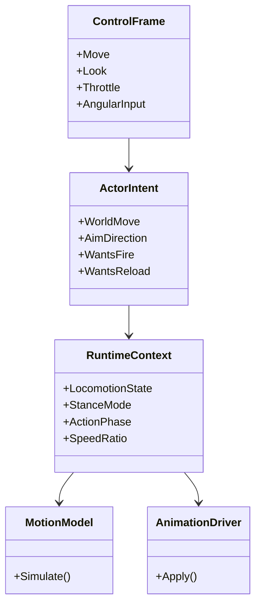

# Asset Preparation Guide / 资产准备指南

## Purpose / 目标

中文：这份文档描述 Blender 资产应该如何准备，才能让角色、武器、载具、炮塔和飞机更自然地接入当前控制核心，并在后续减少滑步、动画切换断裂、IK 不稳定等问题。

English: This document explains how Blender assets should be prepared so characters, weapons, vehicles, turrets, and aircraft can plug into the current control core cleanly while reducing foot sliding, rough transitions, and unstable IK later.

## Character Rig Requirements / 人物骨架要求

- one stable root bone at world motion origin / 一个稳定的根骨，位于角色世界运动原点
- pelvis and spine chain with clean forward axis / 骨盆与脊柱链条前向轴明确
- left and right hand weapon support bones or sockets / 左右手武器支撑骨或挂点
- optional dedicated aim pivot or chest aim helper / 独立瞄准辅助骨或胸部瞄准辅助点
- left and right foot bones with predictable sole orientation / 左右脚骨朝向稳定，脚底法线明确
- camera anchor, head anchor, and interaction anchor helpers / 预留相机锚点、头部锚点、交互锚点

## Character Animation Pack / 人物动画包建议

### Required locomotion set / 建议的基础移动集

- idle relaxed
- walk forward, backward, strafe left, strafe right
- jog or run forward, optional diagonal variants
- crouch idle and crouch locomotion set
- jump start, in-air, land
- turn in place left and right
- start and stop clips for walk and sprint if possible

- 待机
- 前后左右基础行走
- 前向跑步，最好包含斜向变体
- 蹲伏待机与蹲伏移动
- 起跳、空中、落地
- 原地左转和右转
- 最好补齐 walk 和 sprint 的起步与刹停片段

### Combat set / 战斗动画集

- hip fire and aimed fire
- reload variants by weapon family
- equip and unequip
- melee strike or shove
- hit react and death only if the game needs them now

- 腰射与瞄准射击
- 按武器类型区分换弹
- 装备与收起
- 近战挥击或推搡
- 如果当前阶段需要，再做受击与死亡

## NLA and Clip Export Rules / NLA 与动画导出规则

- keep each gameplay clip isolated in its own action or NLA strip / 每个玩法片段单独一个 action 或 NLA strip
- use stable names such as `locomotion_walk_fwd` or `combat_reload_rifle` / 使用稳定命名
- keep pose continuity at clip boundaries / 片段首尾姿态尽量连续
- export in-place locomotion first, then add root-motion variants only where necessary / 先导出原地动画，必要时再补 root motion 版本
- if using root motion, keep translation only on the root bone / root motion 只放在根骨上

## IK Preparation / IK 准备要求

中文：IK 最好不要等进引擎后才补救。对于双手持枪、脚底贴地、攀爬抓点，Blender 阶段就应该预留清晰的目标关系。最实用的方式是给武器和角色都预留明确 socket 或 helper bone。

English: IK should not be treated as an afterthought. For two-hand weapon support, foot placement, and climbing hand targets, clear target relationships should already exist in Blender. The most practical approach is to reserve explicit sockets or helper bones on both the weapon and the character.

- weapon left-hand support socket / 武器左手支撑挂点
- muzzle socket / 枪口挂点
- magazine handle or reload contact helpers / 弹匣或换弹接触辅助点
- foot sole reference orientation / 脚底参考朝向
- climb hand and foot target markers if climbing is planned / 若计划攀爬，预留手脚抓点标记

## Vehicle and Turret Requirements / 载具与炮塔要求

- chassis root separated from turret root / 底盘根与炮塔根分离
- gun barrel pivot separated from turret yaw / 炮管俯仰与炮塔水平旋转分离
- recoil bone or local slide node for the barrel / 预留炮管后坐骨或局部滑块节点
- wheel, track, suspension, and hardpoint helpers clearly named / 轮组、履带、悬挂、挂点命名清晰
- driver camera, gunner camera, and commander camera anchors / 驾驶、炮手、车长相机锚点

## Aircraft Requirements / 飞机要求

- one aircraft body root / 机体根节点唯一
- dedicated pivots for pitch surfaces, roll surfaces, rudder, and landing gear / 升降舵、副翼、方向舵、起落架独立枢轴
- weapon pylons and muzzle helpers / 挂架与发射挂点
- cockpit camera anchor and chase camera anchor / 座舱相机与追踪相机锚点
- optional separate bones for canopy, flaps, and control surfaces / 座舱盖、襟翼、控制面单独骨骼

## How to Reduce Sliding and Bad Transitions / 如何减少滑步与不流畅切换

- match authored animation speed to gameplay speed targets / 动画实际速度与游戏速度对齐
- keep locomotion clips in-place and drive world motion from code for the first MVP / MVP 阶段优先用原地动画加代码驱动位移
- track foot phase for starts, stops, and turns / 记录脚相位，控制起步、刹停和转身
- separate lower-body locomotion from upper-body aiming when possible / 下半身移动与上半身瞄准分层
- use additive aim offsets instead of baking every aim angle into full-body clips / 尽量使用 additive 瞄准偏移
- reserve turn-in-place clips early; they matter more than many teams expect / 尽早准备原地转身动画

## Recommended Interface Contracts / 推荐接口契约

中文：资产只要能稳定服务这个接口链，就能比较优雅地接进系统。

English: As long as the assets can serve this interface chain reliably, they can be integrated into the system cleanly.

## Naming Contract / 命名契约

中文：骨骼、socket、动画 key 的标准命名已单独整理在 [AssetNamingConvention.md](e:/Gogot/road-armed/Docs/Architecture/AssetNamingConvention.md)。建模和动画制作请优先遵循那份规范。

English: The standard names for bones, sockets, and animation keys are documented separately in [AssetNamingConvention.md](e:/Gogot/road-armed/Docs/Architecture/AssetNamingConvention.md). Modeling and animation work should follow that document first.

