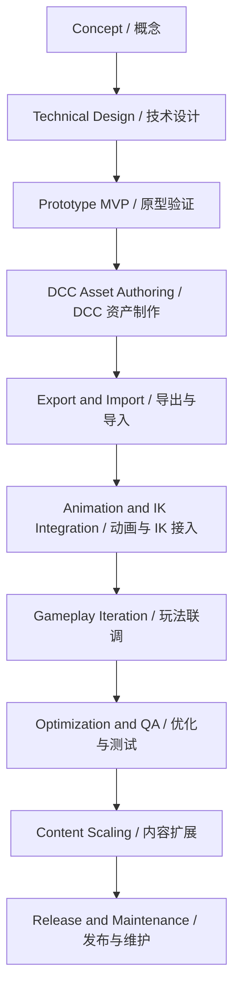

# Full Lifecycle Workflow / 全生命周期标准工作流

## Purpose / 目的

中文：这份文档给你一个面向项目全生命周期的标准工作流，从概念、控制器架构、DCC 制作、导出导入、动画整合、玩法联调、优化、验收到后期扩展。它的目标不是让你记住所有细节，而是让你在每个阶段知道“当前最重要的事是什么，交付物是什么，下一步怎么接”。

English: This document provides a standard project lifecycle workflow covering concept, controller architecture, DCC production, export/import, animation integration, gameplay iteration, optimization, QA, and later expansion. The goal is not to memorize every detail, but to know what matters most at each phase, what the deliverable is, and how the next phase connects.

## Lifecycle Overview / 生命周期总览

## Phase 1: Concept / 阶段一：概念与目标定义

### Goals / 目标

- define the playable fantasy / 定义核心玩法幻想
- define target pillars such as TPS, command mode, vehicles / 定义玩法支柱，例如 TPS、指令模式、载具
- define what the first MVP must prove / 定义 MVP 必须验证什么

### Deliverables / 产物

- one short design brief / 一份简短设计说明
- one list of core verbs / 一份核心动作列表
- one list of mode transitions / 一份模式切换列表

## Phase 2: Technical Design / 阶段二：技术设计

### Goals / 目标

- separate control source, intent, runtime context, motion, combat, animation / 拆分控制源、意图、运行时上下文、运动、战斗、动画
- decide naming conventions and asset contracts / 确定命名规范和资产契约
- decide data ownership / 确定数据所有权

### Deliverables / 产物

- architecture documents / 架构文档
- naming convention / 命名规范
- runtime data schema / 运行时数据结构

### Current status / 当前状态

中文：本项目已经完成到这一阶段并进入 MVP 开发。

English: This project has completed this phase and is already in MVP development.

## Phase 3: Prototype MVP / 阶段三：原型验证

### Goals / 目标

- prove that locomotion, camera, mode switching, and input routing are stable / 验证移动、相机、模式切换、输入路由稳定
- keep visuals cheap and interfaces strict / 视觉先简化，接口先严格
- avoid premature content polish / 避免过早打磨内容

### Deliverables / 产物

- sandbox scene / 沙盒场景
- debug overlay / 调试面板
- baseline controller stack / 基础控制器栈

## Phase 4: DCC Asset Authoring / 阶段四：DCC 资产制作

### Goals / 目标

- build authoring rigs and clean export rigs / 制作 authoring rig 与干净 export rig
- prepare first-pass animation clips / 准备第一批动画片段
- prepare sockets and helper nodes / 准备 socket 和辅助节点

### Deliverables / 产物

- character rig package / 角色骨架包
- locomotion animation set / 基础移动动画集
- first weapon and socket set / 第一批武器与挂点集

## Phase 5: Export and Import / 阶段五：导出与导入

### Goals / 目标

- export stable game-ready assets / 导出稳定、可用于游戏的资产
- configure importer once and reuse settings / 首次导入配置固定并复用
- validate skeleton, sockets, materials, and animation clips / 校验骨架、socket、材质和动画

### Deliverables / 产物

- imported Godot scenes and resources / Godot 内导入后的场景与资源
- importer presets / 导入预设
- rig validation results / 骨架校验结果

## Phase 6: Animation and IK Integration / 阶段六：动画与 IK 接入

### Goals / 目标

- wire AnimationTree parameters to runtime context / 将 AnimationTree 参数接到运行时上下文
- add upper-body aim, reload, and override layers / 增加上半身瞄准、换弹、覆盖层
- add IK only where authored animation needs support / 仅在动画需要时增加 IK

### Deliverables / 产物

- AnimationTree contract / AnimationTree 合同
- aim and reload blending / 瞄准与换弹混合
- foot and hand IK plan / 手脚 IK 方案

## Phase 7: Gameplay Iteration / 阶段七：玩法联调

### Goals / 目标

- sync movement speed to authored clips / 让移动速度和动画速度对齐
- test weapon handling, interaction, inventory, mode switching / 测试武器、交互、物品栏、模式切换
- remove sliding and transition roughness / 消除滑步和生硬切换

### Deliverables / 产物

- tuned motion settings / 调好的移动参数
- stable animation transitions / 稳定的动画转场
- debug traces and regression notes / 调试记录与回归说明

## Phase 8: Optimization and QA / 阶段八：优化与测试

### Goals / 目标

- reduce unnecessary animation and IK cost / 降低不必要的动画与 IK 成本
- test reimport safety / 测试重导入安全性
- verify asset contract compliance / 验证资产契约一致性

### Deliverables / 产物

- profiling notes / 性能分析记录
- asset validation checklist / 资产校验清单
- regression test scenarios / 回归测试场景

## Phase 9: Content Scaling / 阶段九：内容扩展

### Goals / 目标

- add more characters without changing the core / 在不改核心的前提下扩充角色
- add vehicles and aircraft as new motion models / 以新运动模型方式加入载具与飞机
- add AI as new control sources / 以新控制源方式加入 AI

### Deliverables / 产物

- reusable character template / 可复用角色模板
- vehicle rig template / 载具模板
- AI source adapters / AI 输入适配器

## Phase 10: Release and Maintenance / 阶段十：发布与维护

### Goals / 目标

- keep import pipeline deterministic / 保持导入流程可重复
- document every pipeline change / 记录每次管线变更
- preserve compatibility when assets evolve / 在资产演进时保持兼容

### Deliverables / 产物

- versioned pipeline docs / 版本化管线文档
- migration notes / 迁移说明
- issue triage process / 问题分诊流程

## Rules of Thumb / 实战准则

- prototype logic before polishing content / 先原型验证，再打磨内容
- keep authoring rig flexible, export rig strict / authoring rig 灵活，export rig 严格
- never let animation naming drift from code contracts / 不允许动画命名脱离代码契约
- prefer code-authoritative locomotion before selective motion warping / 先代码权威移动，再局部引入 motion warping
- treat reimport as a first-class workflow / 把重导入当成一等工作流来设计

## Related Documents / 相关文档

- [GodotControllerArchitecture.md](e:/Gogot/road-armed/Docs/Architecture/GodotControllerArchitecture.md)
- [MultiModalControlCore.md](e:/Gogot/road-armed/Docs/Architecture/MultiModalControlCore.md)
- [AssetNamingConvention.md](e:/Gogot/road-armed/Docs/Architecture/AssetNamingConvention.md)
- [AssetPreparationGuide.md](e:/Gogot/road-armed/Docs/Architecture/AssetPreparationGuide.md)
- [DccRigWorkflow.md](e:/Gogot/road-armed/Docs/Architecture/DccRigWorkflow.md)
