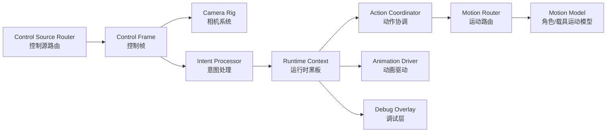

# Godot TPS/FPS/RTS Hybrid Architecture / Godot TPS/FPS/RTS 混合架构

## Project Intent / 项目目标

中文：这个项目的目标不是只做一个单一的第三人称控制器，而是先建立一个可持续扩展的控制核心。它要能先支撑 TPS，再自然长出近身 FPS、RTS 指令模式、地面载具、空中载具，以及 AI/网络回放等输入来源。

English: The goal is not to build only a third-person controller. The goal is to establish a control core that can start with TPS, then grow into near-FPS, RTS command mode, ground vehicles, aircraft, AI, and replay or network-driven inputs.

## System Diagram / 系统图

## Why We Are Not Continuing `BBBN` / 为什么不继续沿用 `BBBN`

中文：`BBBN` 更像是把 Unity 风格的控制器外壳直接搬进 Godot，而不是按 Godot 的节点职责去组织。它的主要问题包括：输入层主动查找场景对象、移动逻辑重复执行、相机依赖没有闭合、状态层太薄，导致后面很难安全扩展。

English: `BBBN` looks like a Unity-shaped controller shell transplanted into Godot instead of a Godot-native node composition. Its main issues are hidden scene lookups from the input layer, duplicated movement responsibility, loose camera wiring, and a state layer that is too thin for safe expansion.

## What We Keep from `BBB-Nexus` / 从 `BBB-Nexus` 中保留什么

中文：真正值得借鉴的是“分阶段处理”的思想，而不是类名本身。参考项目把控制拆成“输入采样 -> 数据快照 -> 意图处理 -> 运行时黑板 -> 状态/表现消费”，这让角色逻辑不会直接依赖硬件输入。

English: The valuable part is the staged processing model, not the class names. The reference project separates control into input sampling, snapshots, intent processing, runtime blackboard data, and state or presentation consumers. That keeps gameplay logic away from raw hardware input.

## Godot-Native Runtime Flow / Godot 原生运行流

1. `ControlSourceNode` writes a `ControlFrame`.
2. `PlayerCameraRig` consumes look and zoom input and updates view state.
3. `PlayerIntentProcessor` converts the frame into an `ActorIntent`.
4. `CharacterRuntimeContext` stores authoritative blackboard data.
5. `CharacterActionCoordinator` resolves stance, locomotion, and action state.
6. `ActorMotionRouter` selects an `IActorMotionModel` implementation.
7. `ICharacterAnimationDriver` consumes the same runtime context.

1. `ControlSourceNode` 写入一份 `ControlFrame`。
2. `PlayerCameraRig` 消费视角与缩放输入，并更新视图状态。
3. `PlayerIntentProcessor` 把输入帧翻译成 `ActorIntent`。
4. `CharacterRuntimeContext` 保存权威运行时黑板数据。
5. `CharacterActionCoordinator` 解析姿态、移动态和动作态。
6. `ActorMotionRouter` 选择一个 `IActorMotionModel` 实现。
7. `ICharacterAnimationDriver` 消费同一份运行时上下文。

## Current Folder Ownership / 当前目录职责

- `Game/Input`: player input, AI input, replay input, shared control frame contracts
- `Game/Character/Components`: runtime context, intent processing, motion models, action and animation coordination
- `Game/Character/Nodes`: actor root nodes
- `Game/Character/Resources`: tunable motor and camera settings
- `Game/Camera`: camera rig and future mode transitions
- `Game/UI/Debug`: runtime inspection overlay
- `Scenes/Characters`: reusable actor scenes
- `Scenes/Camera`: reusable camera rig scenes
- `Scenes/Sandbox`: debug playground scenes

- `Game/Input`：玩家输入、AI 输入、回放输入、共享控制帧协议
- `Game/Character/Components`：运行时上下文、意图处理器、运动模型、动作与动画协调
- `Game/Character/Nodes`：角色根节点
- `Game/Character/Resources`：可调参数资源
- `Game/Camera`：相机 rig 与后续模式切换
- `Game/UI/Debug`：运行时调试覆盖层
- `Scenes/Characters`：可复用角色场景
- `Scenes/Camera`：可复用相机场景
- `Scenes/Sandbox`：调试沙盒场景

## Current Implemented Foundation / 当前已实现基础

中文：当前已经落地的第一批脚本包括 `ControlMode`、`ControlFrame`、`ActorIntent`、`ControlSourceNode`、`ControlSourceRouter`、`PlayerInputRouter`、`AiControlSource`、`CharacterRuntimeContext`、`PlayerIntentProcessor`、`CharacterActionCoordinator`、`ActorMotionRouter`、`IActorMotionModel`、`CharacterMotor`、`ICharacterAnimationDriver`、`CharacterAnimationDriver`、`PlayerActor`、`PlayerCameraRig` 和调试覆盖层。还新增了新的测试场景 `Scenes/Sandbox/ControllerPlayground.tscn`。

English: The first implemented scripts are `ControlMode`, `ControlFrame`, `ActorIntent`, `ControlSourceNode`, `ControlSourceRouter`, `PlayerInputRouter`, `AiControlSource`, `CharacterRuntimeContext`, `PlayerIntentProcessor`, `CharacterActionCoordinator`, `ActorMotionRouter`, `IActorMotionModel`, `CharacterMotor`, `ICharacterAnimationDriver`, `CharacterAnimationDriver`, `PlayerActor`, `PlayerCameraRig`, and the debug overlay. A new test scene was also added at `Scenes/Sandbox/ControllerPlayground.tscn`.

## Immediate Next Work / 下一步工作

- add combat and equipment coordinators
- connect an AnimationTree and upper-body aim offsets
- add world interaction and command picking
- add AI control sources that write into the same `ControlFrame`
- add additional motion models for vehicles and aircraft

- 增加战斗与装备协调层
- 接入 AnimationTree 和上半身瞄准偏移
- 增加世界交互与指令拾取
- 构建写入同一 `ControlFrame` 的 AI 控制源
- 增加载具与飞机的运动模型
